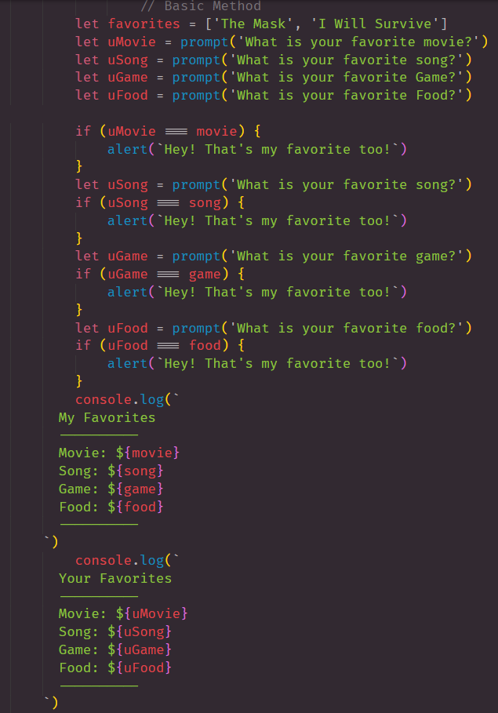

# javaScript101

# What is this Repo?
> This repo was just a practice repo so that we could understand the use of prompts and how to use it. 
```
 We also went over:
    > Console Logging to the Browser
    > Console Commands
    > If/ELSE IF Statement
    > Switch Case
    > Conditional Logic
```




## LINKS

- [javaScript101 Link](https://nicholasd-uci.github.io/javaScript101/index.html)
- [Github Repo Link](https://github.com/nicholasd-uci/javaScript101)
- [Nicholas Dallas GitHub](https://github.com/nicholasd-uci)

- - -
© 2020 NPRD, Nicholas Paul Ruiz Dallas